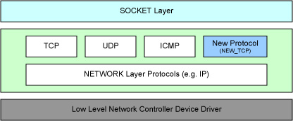

##介绍
在我们的Infortaiment系统里面，大量的用到了DBus来进行模块之间的通信，但是在DBus高负载的情况下，性能不是很好。于是又这样的一个项目尝试对DBus进行优化，我对此也非常的感兴趣，希望能对其进一步的学习。该项目试图把DBus封装为一个Linux内核里面的协议，通过套接字接口来进行访问。由于我不熟悉怎么样在Linux的网络子系统通添加一个新的协议族，正好过google发现了这边博文，故学习并翻译记录之，希望对大家有用。

[原文地址](https://linuxwarrior.wordpress.com/2008/12/02/add-a-new-protocol-to-linux-kernel/)

## 译文
Linux内核网络子系统支持许多协议，它足够灵活使得我们可以增加一种新的协议。这些协议可以通过套接字接口的协议族（Protocol
family）的方式来让用户应用程序使用。接下来的部分会介绍增加一个新的协议族的主要步骤（基于Linux内核2.6.24），然而本文不会覆盖新的协议的具体实现。

Linux 网络子系统的一个高层的视图：


如上图所示，对于本文所考虑的范围，我们可以认为Linux的网络子系统由如下三层组成：

####1. 最上层的"套接字"层处理所有套接字相关的系统调用。它鉴别协议族并把调用转发到对于的协议实现里面。
####2. 接下来的一层实现了传输层和网络层协议，在这一层里面我们可以引入一个新的协议族。
####3. 最下面的一层是提供硬件访问能力的网络控制设备驱动。

##增加一个新的协议栈

在Linux内核网路子系统里面，数据结构"struct proto" (/include/net/sock.h)和"struct net_proto_family" (/include/linux/net.h)封装了网络协议族的实现。 下面的这些代码展示了一个简化的例子，一步一步的实现了注册一个类似于TCP/IP栈(基于IP作为网络层)的新的协议族。 所有的协议相关的新的待实现函数都以"my_"作为前缀。

####1) 初始化"struct
proto"的一个实例并且注册通过调用"proto_register()"注册到Linux网络子系统。

``` cpp
/* Protocol specific socket structure */
struct my_sock {
    struct inet_sock isk;
    /* Add the Protocol implementation specific data members per socket here from here on */
};

struct proto my_proto = {
    .close = my_close,
    .connect = my_connect,
    .disconnect = my_disconnect,
    .accept = my_accept,
    .ioctl = my_ioctl,
    .init = my_init_sock,
    .shutdown = my_shutdown,
    .setsockopt = my_setsockopt,
    .getsockopt = my_getsockopt,
    .sendmsg = my_sendmsg,
    .recvmsg = my_recvmsg,
    .unhash = my_unhash,
    .get_port = my_get_port,
    .enter_memory_pressure = my_enter_memory_pressure,
    .sockets_allocated = &sockets_allocated,
    .memory_allocated = &memory_allocated,
    .memory_pressure = &memory_pressure,
    .orphan_count = &orphan_count,
    .sysctl_mem = sysctl_tcp_mem,
    .sysctl_wmem = sysctl_tcp_wmem,
    .sysctl_rmem = sysctl_tcp_rmem,
    .max_header = 0,
    .obj_size = sizeof(struct my_sock),
    .owner	= THIS_MODULE,
    .name	= "NEW_TCP",
};

rc = proto_register(&my_proto, 1);
```

####2)提供一个接口用来作为新协议的套接字创建例程，并通过调用"sock_register()"来把它注册到套接字层。"family"成员指定了新的协议的地址族。

``` cpp
struct net_proto_family my_net_proto = {
    .family = AF_INET_NEW_TCP,
    .create = my_create_socket,
    .owner	= THIS_MODULE,
};

rc = sock_register(&my_net_proto, 1);
```

####3)新的协议的地址族是用户使用套接字调用新的协议实现的唯一的接口。应该在/include/linux/socket.h中添加这个新协议地址族AF_INET_NEW_TCP。任何通过这个地址族调用的socket()都会被转到内核中的my_create_socket()函数，这个函数创建了随后所有对这个新协议套接字操作的基础。

####4)协议的实现者可以选择面向连接或者无连接的方式实现该协议。在套接字创建例程里，协议的实现者需要指定一个"struct proto_ops"
(/include/linux/net.h)的实例。如步骤1里面指定的，套接字层通过调用proto_ops实例的函数成员来调用协议相关的函数。创建一个面向连接的类TCP/IP协议的套接字例程的典型实现如下面的代码所示：

```cpp
static struct proto_ops my_proto_ops = {
    .family = PF_INET,
    .owner = THIS_MODULE,
    .release = inet_release,
    .bind = my_bind,
    .connect = inet_stream_connect,
    .socketpair = sock_no_socketpair,
    .accept = inet_accept,
    .getname = inet_getname,
    .poll = my_poll,
    .ioctl = inet_ioctl,
    .listen = my_inet_listen,
    .shutdown = inet_shutdown,
    .setsockopt = sock_common_setsockopt,
    .getsockopt = sock_common_getsockopt,
    .sendmsg = inet_sendmsg,
    .recvmsg = sock_common_recvmsg,
};

static int my_create_socket(struct socket *sock, int protocol)
{
    struct sock *sk;
    int rc; 
    
    sk = sk_alloc(PF_INET_NEW_TCP, GFP_KERNEL, &my_proto, 1);
    if (!sk) {
        printk("failed to allocate socket.\n");
        return -ENOMEM;
    } 
    
    sock_init_data(sock, sk);
    sk->sk_protocol = 0x0; 
    
    sock->ops = &my_proto_ops;
    sock->state = SS_UNCONNECTED; 
    
    /* Do the protocol specific socket object initialization */
    return 0;
};
```

## 参考文献
https://lwn.net/Articles/504722/
https://lwn.net/Articles/504970/


